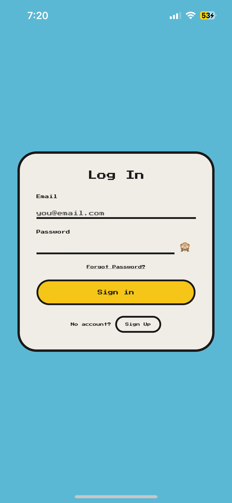
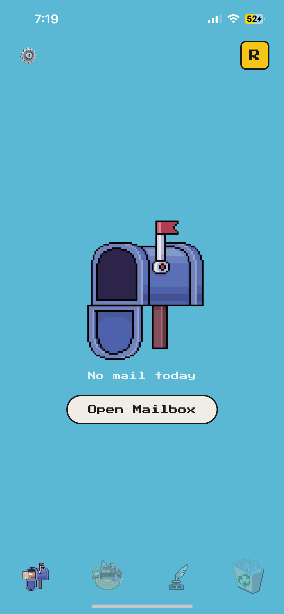
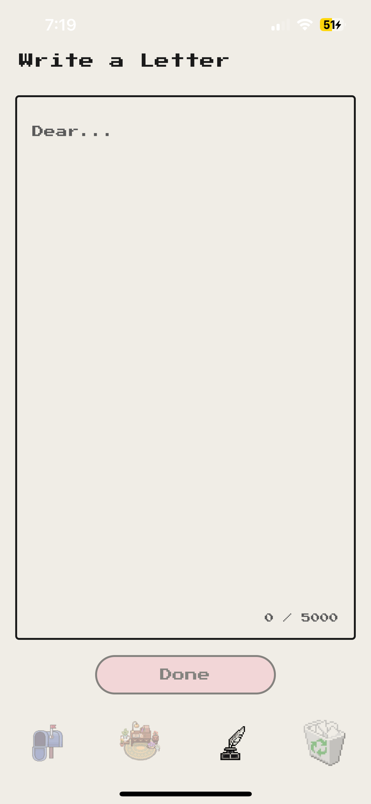
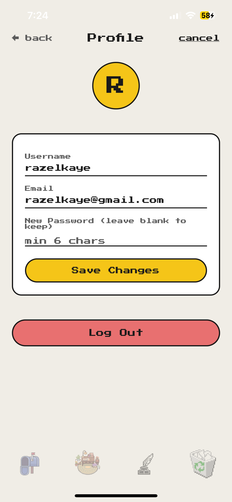
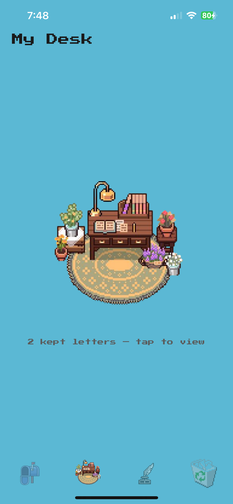
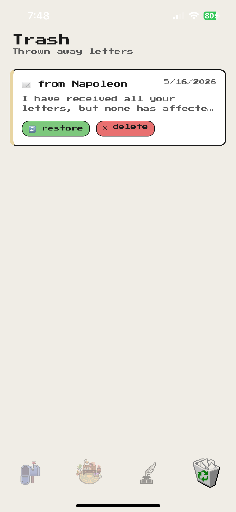

# 📬 SlowMail

> *A mobile app that brings back the feeling of waiting for a letter.*

SlowMail is a pen-pal style letter exchange app where messages are delivered the next day — not instantly. You write a letter, seal it in an envelope, and send it. It arrives in the recipient's mailbox the following morning at 9:00 AM. No read receipts. No instant delivery. Just the quiet anticipation of waiting.

Built as a final project for **Mobile Development** at the **University of San Carlos**.

---

## Screenshots

| Login | Mailbox | Write a Letter |
|-------|---------|----------------|
|  |  |  |

| Profile | Desk | Trash |
|-----------------|------|-------|
|  |  |  |


---

## How to Use

### 1. Create an Account
- Open the app and tap **Sign Up**
- Enter a username, email, and password
- You'll be taken to your mailbox automatically

### 2. Send a Letter
- Tap the **✉️ Write** tab at the bottom
- Type your letter on the paper (up to 5000 characters)
- Tap **Next →** when done writing
- Choose an envelope style — tan, lavender, or pink
- Search for the recipient by username and tap their name
- Tap **Mail ✉** to send

### 3. Receive a Letter
- Letters are delivered the **next morning at 9:00 AM**
- Open the **📭 Mailbox** tab and tap **Open Mailbox**
- Tap any envelope to read the letter
- After reading, choose:
  - **Keep** — saves it to your Desk
  - **Throw** — moves it to Trash

### 4. Your Desk
- Tap the **📚 Desk** tab to see all kept letters
- Tap any card to read the full letter
- Tap 🗑 to move a letter to Trash

### 5. Trash
- Tap the **🗑 Trash** tab to see thrown letters
- Tap **↩ restore** to move a letter back to your mailbox
- Tap **✕ delete** to permanently delete it — this cannot be undone

### 6. Profile
- Tap the **👤** icon at the top right of any screen
- Tap **edit** to update your username, email, or password
- Tap **Log Out** to sign out

---

## Features

- ✉️ **Write & send letters** — compose, pick an envelope style, address to any user
- 📬 **Delayed delivery** — letters arrive the next day at 9:00 AM via server cron
- 📭 **Mailbox** — collect delivered letters
- 📚 **Desk** — permanently store letters you want to keep
- 🗑 **Trash** — restore or permanently delete thrown letters
- 👤 **Profile** — update username, email, and password

---

## Tech Stack

| Layer | Technology |
|-------|-----------|
| Mobile App | React Native + Expo (SDK 54) |
| Navigation | Expo Router |
| Language | TypeScript |
| HTTP Client | Axios |
| Local Storage | AsyncStorage |
| Backend API | Pure PHP (no framework) |
| Database | MySQL |
| DB Queries | PDO (parameterized) |
| Auth | Bearer token (custom) |
| Hosting | dcism.org school server |
| Scheduler | Unix cron (SSH) |
| Font | Press Start 2P |

---

## API

**Base URL:** `http://lostnfound.dcism.org/api/index.php`

All requests use `?route=` query parameter. Protected routes require:
```
Authorization: Bearer {token}
```

| Method | Route | Auth | Description |
|--------|-------|------|-------------|
| POST | `auth/register` | No | Register new user |
| POST | `auth/login` | No | Login, returns token |
| POST | `auth/logout` | Yes | Invalidate token |
| GET | `auth/me` | Yes | Current user info |
| POST | `auth/update` | Yes | Update profile |
| GET | `mailbox` | Yes | Delivered letters |
| POST | `letters/send` | Yes | Send a letter |
| POST | `letters/keep?id=N` | Yes | Keep a letter |
| POST | `letters/throw?id=N` | Yes | Move to trash |
| POST | `letters/restore?id=N` | Yes | Restore from trash |
| POST | `letters/delete?id=N` | Yes | Permanently delete |
| GET | `desk` | Yes | Kept letters |
| GET | `trash` | Yes | Trashed letters |
| GET | `outbox` | Yes | Sent letters + status |
| GET | `users/search?q=` | Yes | Search users |

---

## Letter Delivery Lifecycle

```
User sends letter
      ↓
  status: pending
      ↓
  [midnight cron — 00:01]
      ↓
  status: in_transit
      ↓
  [morning cron — 09:00]
      ↓
  status: delivered  ←  appears in recipient's mailbox
```

---

## Database Schema

```sql
users           — id, username, email, password
tokens          — id, user_id, token, expires_at
letters         — id, sender_id, receiver_id, body, envelope_style, status, sent_at, delivered_at
kept_letters    — id, user_id, letter_id, kept_at
trashed_letters — id, user_id, letter_id, trashed_at
```

---

## Running Locally

### Mobile App

```bash
git clone https://github.com/yourusername/SlowMail.git
cd SlowMail
npm install --legacy-peer-deps
npx expo start
```

Scan the QR code with **Expo Go** on your phone, or press `i` for iOS simulator / `a` for Android.

> Update `lib/api.ts` → `BASE` if you're running your own backend.

### Backend (PHP)

1. Upload the `backend/` folder to your PHP server
2. Create a MySQL database and run `backend/api/install.sql` in phpMyAdmin
3. Edit `backend/api/db.php` with your database credentials
4. Add cron jobs via SSH:
```
1 0 * * *  php /path/to/deliver.php
0 9 * * *  php /path/to/deliver.php
```

---

## Building the APK

```bash
eas build -p android --profile preview
```
Or download the latest APK directly from the [Releases page](https://github.com/yourusername/SlowMail/releases/latest).

---

## Course Information

| | |
|---|---|
| **Subject** | Mobile Development |
| **Instructor** | Chris Ray B. Belarmino |
| **School** | University of San Carlos |
| **Department** | Computer, Information Sciences and Mathematics |
| **Term** | May 2026 |

---

## Asset Attribution

The visual assets used in this project are **not owned by the authors**. They are used strictly for academic and portfolio purposes — this project is non-commercial and will not be publicly distributed or monetized.

| Asset | Artist / Source |
|-------|----------------|
| Desk illustration | [5krad](https://www.instagram.com/5krad) (IG) / [fivekrad](https://x.com/fivekrad) (X) |
| Mailbox illustration | Kaleb Da Silva Pereira |
| Compose & settings icons | Collaborapix Studio |
| Trash bin icon | Windows 95 Recycle Bin (Microsoft) |
| Press Start 2P font | CodeMan38 — [Google Fonts](https://fonts.google.com/specimen/Press+Start+2P) (SIL Open Font License) |

> No formal permission was obtained for the illustrations and icons listed above. Full credit goes to their respective creators. If you are one of the artists and would like the asset removed, please open an issue or contact the authors directly.

---

## License

For academic and portfolio purposes only. Not for commercial use or public distribution.
